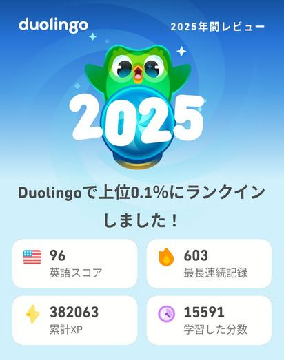

# Advent Calendar 2025 続けていること

## 石の上にも… 

Duolingoの年間Reviewが報告されたので，ここ10年ほど続けていることについて書いてみる。
Duolingoはゲーム感覚で学習できるので，続けやすい。毎日ログインして学習を続けると連続日数が増えていき，モチベーションになる。たまに忙しいときは1レッスンだけやることもあるが，それでも毎日続けていることに意味があると思っている。

石の上にも3年ということわざがあるが，これは「辛抱強く努力すれば，やがて成果が得られる」という意味である。石の上に3年間座り続けることで，その冷たさにも慣れ，最終的には快適に感じられるようになるという比喩であるが，なにか新しいことを始めるときに3年もしくは1000時間というのは，いつも意識しているし学生にもそう指導している。

ここ10年の私を振り返ると，PokemonGo -> Monster Strike を連続ログインをそれぞれ3年続け，今はDuolingoという語学学習アプリを毎日続けている。最初はせっかく覚えた中国語を忘れないようにという目的で始めたが，今では英語学習がメインになっている。

中学校のとき5教科の中で他の教科よりも勉強しているのに英語だけがわりと苦手で特に文法が嫌いだった。海外に行くようになってから必要最小限はやり取りするが，他のことに比べると上達が遅いように感じている。ネイティブではない外国人がそこまで勉強したわけではないだろうに，苦もなくやりとりしているのを見ると，少しねたましい気もする。

私の場合は海外での友達づくりが主な目的だが，IT業界にいると英語は避けて通れない。技術文書や論文，ブログ記事などはほとんどが英語で書かれているし，英語ができないと情報収集やコミュニケーションに支障が出るので，学生も早いうちにその重要性に気づくこと，またProgramming学習と同じく時間がかかること，継続が大切なことを知ってもらい何かを始めそして続けることの大事さを知るきっかけになればと思っている。

# 過去のアドベント

- [アイカレいまむかし 2002 - 2010](https://gist.github.com/omas/06fa04e2ae336752417198ae6f2ce749)
- [アイカレいまむかし 2011 - 2015](https://gist.github.com/omas/d719a6aef8b6a76932437a22ae323cde)
